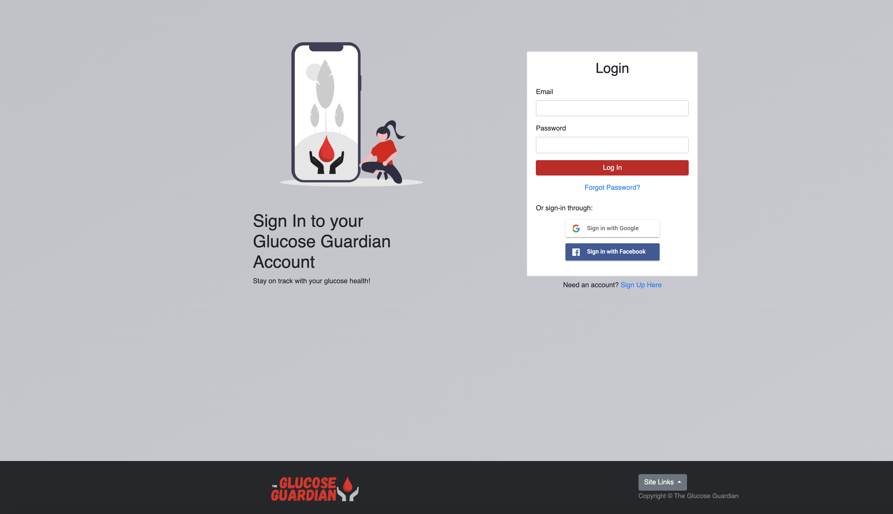
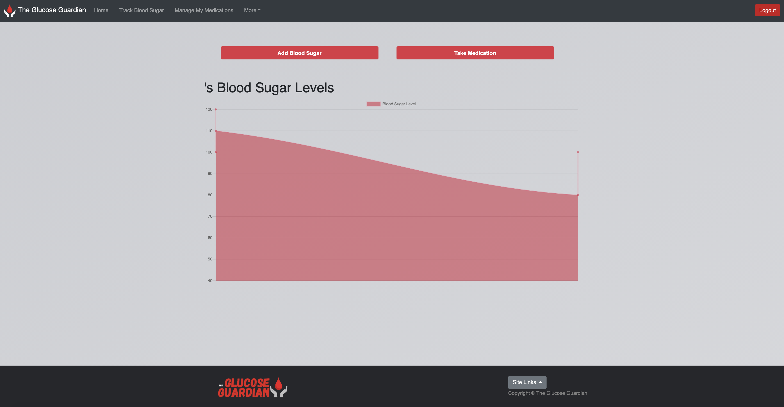
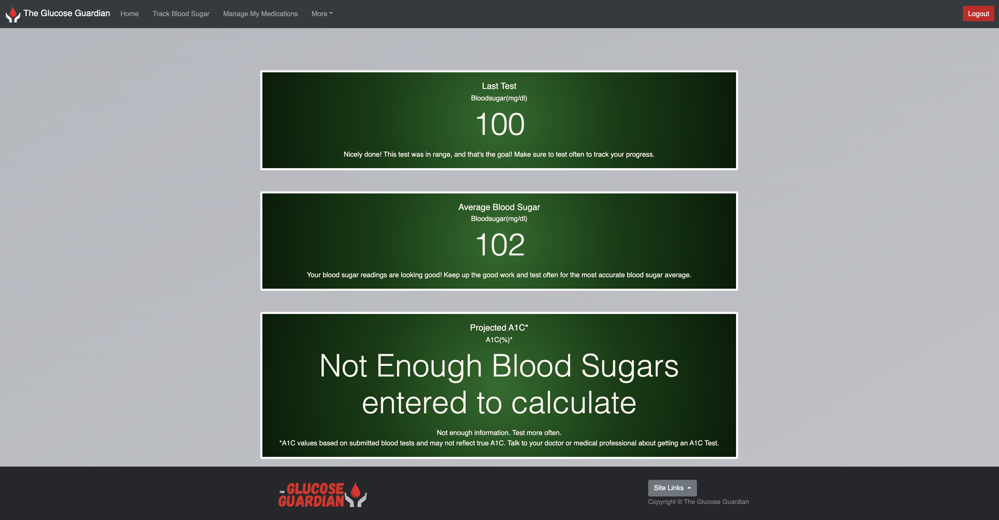
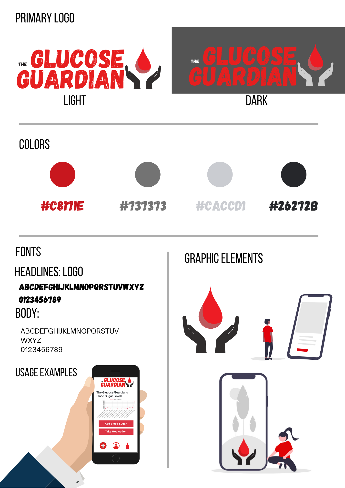
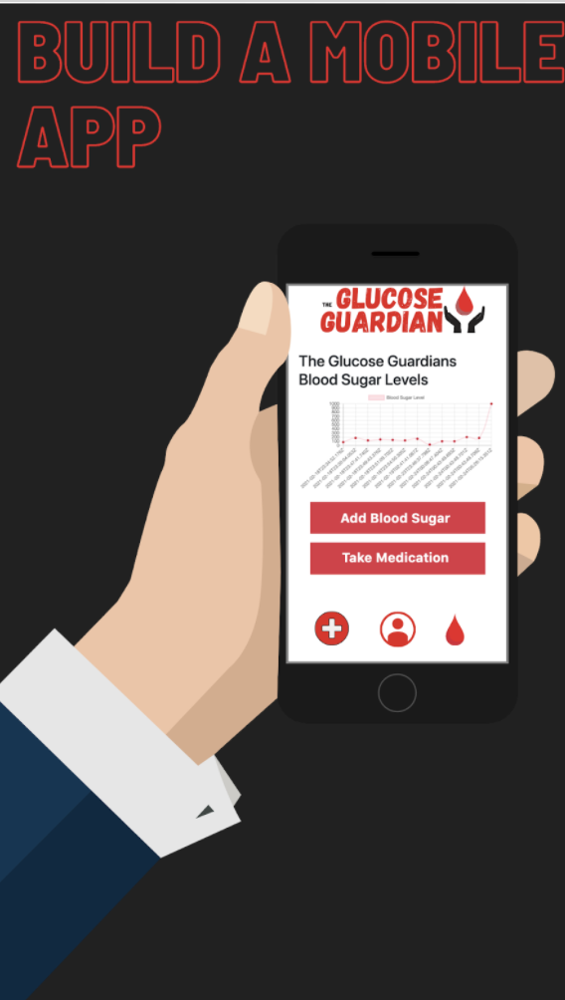
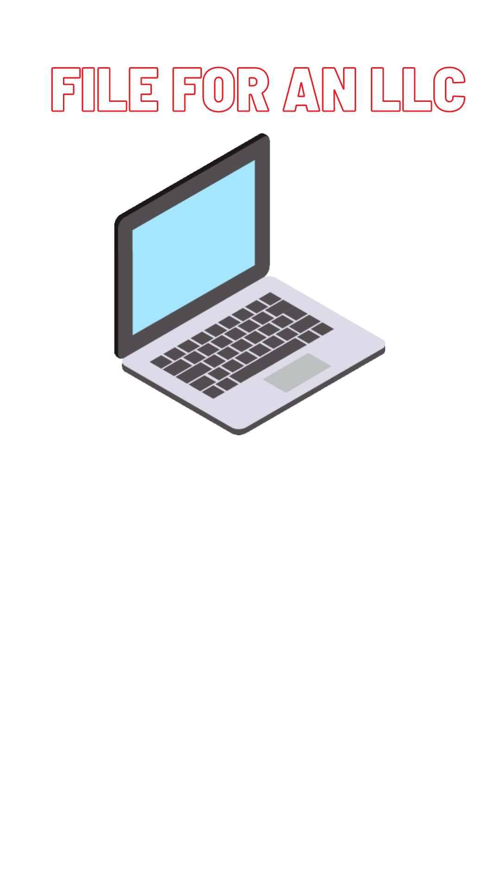

# The Glucose Guardian presented by the Guaridans of the Glucose


* We acknowledge the repo is spelling incorrectly and we will create a new repo as we work on future developments





## The Glucose Guardian Application


## Table of Contents
1. [User story](#User-story)
2. [About the Project](#About-the-Project)
3. [Tech/Framework used](#Tech-Used)
4. [UI/ Desing](#UI-Design)
5. [License](#License)
6. [Contact](#Contact)
7. [Future Developments](#Future-Developments)

## User Story

```
As a diabetic I want an easy and polished app to use 

So that I can track my blood sugar levels and not feel off during my day

As a diabetic I also want an easy to use application 

That helps remind me about my medication intake.

```


## About the Project


The Glucose Guardians is a React application built for people with type 1 and 2 diabetics to track their blood sugar, medications and more. This makes it easy to identify blood sugar trends and retain your data. You can also schedule reminders to ensure that you are diligent about checking your blood sugar. Whether you have diabetes or prediabetes, this app makes it easy to track your blood glucose levels.






Checkout out [Figma Sketch here](https://www.figma.com/file/fcfGI4w1hvvHJ1DnSJgkE7/GlucoseGuardians?node-id=0%3A1)


Check out the [video Walk through here]()

Explore the [Deployed Glucose Guardian Page](https://glucose-guardians.herokuapp.com/login)

View the [ Github page](https://github.com/GlucoseGaurdians/Glucose-Gaurdians)


Our [project management and communication board is here](https://github.com/GlucoseGaurdians/Glucose-Gaurdians/projects/1?add_cards_query=is%3Aopen)


## Tech Used

* ReactJS
* Firebase - wtih Facebook and Google login authentication
* MongoDB
* ChartJS
* Gradient UI
* Figma 
* Adobe Creative Cloud 
* Axios 
* UI Research 


## UI-Design




## Contribute

Reach out to us below if you'd like to fork the project and work on it. This project will be going private as we have future developments of the application we want to work on!


## License 
None
 
## Contact the Guardian of the Glucose Team


Cameron Hickey- [Full Stack Developer](https://github.com/Chickey49)
camslens@gmail.com


Ian Wren- [Project Manager/ Full Stack Developer](https://github.com/luckyian)
ian.wren@gmail.com


Mykel Valadez- [Full Stack Developer](https://github.com/valadezMykel)  
valadezmykel@gmail.com


Suzy Le Bel - [Full Stack Developer](https://github.com/suzylebel)
suzy.lebel@gmail.com


## Future Developments 

We want to expand on this project! There is lots of room to grow and keep updating and debugging. Our next step is to make it into a mobile application with react native. 

Here are some ideas we have for future developemnts: 

* Make it into a mobile application. Move the Navbar to the bottom of app to make it as user friendly as possible. 



* Track carbs and estimation for meals 

* Update chart and mapping displays on mobile 

* Make data stored in a calendar chart to reference back on
Pulling up previous comments on Blood Sugars




[View our presentation slides here](https://docs.google.com/presentation/d/1TK8uOtg1wVTBl0NNLYVIYTMRz32QAF0gJgF3jq2DPJk/edit?usp=sharing)

